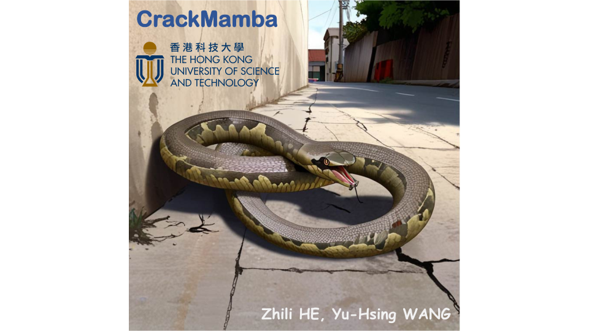

  

# CrackMamba
This repository is the official PyTorch implementation of Mamba meets crack segmentation.

### 🍓 Paper:
- The initial version of the paper can refer to the [arXiv version](https://arxiv.org/abs/2407.15714) or [ResearchGate](https://www.researchgate.net/publication/382459254_Mamba_meets_crack_segmentation).  

